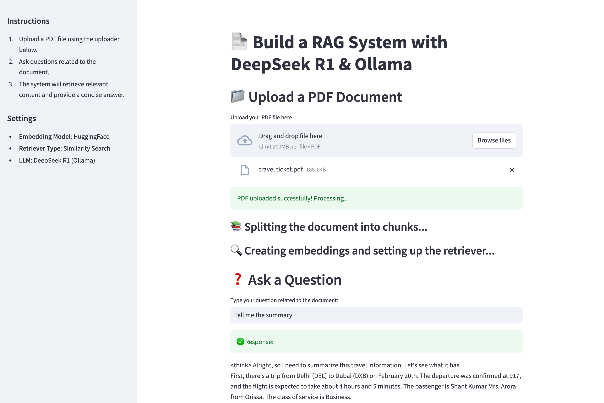

# **Setting Up Ollama & Running DeepSeek R1 Locally for a Powerful RAG System**  

## **🔹 AI | RAG | Python | DeepSeek**  

## **🤖 Ollama**  
Ollama is a framework for running large language models (LLMs) locally on your machine. It allows you to download, run, and interact with AI models without relying on cloud-based APIs.  

#### streamlet UI


### **Why use it?**  
✅ Free  
✅ Private & Secure  
✅ Fast  
✅ Works Offline  

## Yes Docker Ready
`docker run -p 8501:8501 vismis/streamlit-app-deepseeker1-7b:1.0.0`

### **Example Usage:**  
```sh
ollama run deepseek-r1:1.5b
```
This command runs DeepSeek R1 locally.  

---  

## **🔗 LangChain**  
LangChain is a Python/JavaScript framework that helps integrate LLMs with external data sources, APIs, and memory.  

### **Why use it?**  
- Connects LLMs to real-world applications like chatbots, document processing, and Retrieval-Augmented Generation (RAG).  

---  

## **📄 What is RAG (Retrieval-Augmented Generation)?**  
RAG is an AI technique that retrieves external data (e.g., PDFs, databases) and augments the LLM’s response.  

### **Why use it?**  
✅ Improves accuracy  
✅ Reduces hallucinations  
✅ Enhances LLM responses with real-world data  

### **Example:**  
AI-powered PDF Q&A system that retrieves relevant document content before generating answers.  

---  

## **⚡ DeepSeek R1**  
DeepSeek R1 is an open-source AI model optimized for reasoning, problem-solving, and factual retrieval.  

### **Why use it?**  
✅ Strong logical capabilities  
✅ Great for RAG applications  
✅ Can be run locally with Ollama  

---  

## **🚀 How They Work Together?**  
1️⃣ **Ollama** runs DeepSeek R1 locally.  
2️⃣ **LangChain** connects the AI model to external data.  
3️⃣ **RAG** enhances responses by retrieving relevant information.  
4️⃣ **DeepSeek R1** generates high-quality answers.  

### **💡 Example Use Case**  
A Q&A system that allows users to upload a PDF and ask questions about it, powered by DeepSeek R1 + RAG + LangChain on Ollama! 🚀  

---  

## **🎯 Why Run DeepSeek R1 Locally?**  

| Benefit         | Cloud-Based Models | Local DeepSeek R1 |
|----------------|--------------------|-------------------|
| **Privacy**    | ❌ Data sent to external servers | ✅ 100% Local & Secure |
| **Speed**      | ⏳ API latency & network delays | ⚡ Instant inference |
| **Cost**       | 💰 Pay per API request | 🆓 Free after setup |
| **Customization** | ❌ Limited fine-tuning | ✅ Full model control |
| **Deployment** | 🌍 Cloud-dependent | 🔥 Works offline & on-premises |

---

## **🛠 Step 1: Installing Ollama**  
### **🔹 Download Ollama**  
Ollama is available for macOS, Linux, and Windows.  

1️⃣ Go to the [official Ollama download page](https://ollama.com/download)  
2️⃣ Select your operating system  
3️⃣ Click on the **Download** button  
4️⃣ Install it following the system-specific instructions  

---

## **🛠 Step 2: Running DeepSeek R1 on Ollama**  

### **🔹 Pull the DeepSeek R1 Model**  
To download and set up the DeepSeek R1 (1.5B parameter model), run:  
```sh
ollama pull deepseek-r1:1.5b
```

### **🔹 Running DeepSeek R1**  
After the model is downloaded, start interacting with it using:  
```sh
ollama run deepseek-r1:1.5b
```

---

## **🛠 Step 3: Setting Up a RAG System Using Streamlit**  

### **🔹 Prerequisites**  
Before running the RAG system, install the required dependencies:  

```sh
git clone https://github.com/vishalm/deepseek-rag.git
cd deepseek-rag
virtualenv venv
source venv
pip install -r requirement.txt
```

## **🛠 Step 4: Running the App**  
Once the script is ready, start your Streamlit app:  

```sh
streamlit run app.py
```

---


### Model Information
```
tail -f  ~/.ollama/logs/server.log
```

##### Model Information


#### macmon


## **🚀 Summary**  
You now have a fully functional local RAG system powered by:  
✅ **Ollama** for running DeepSeek R1 locally  
✅ **LangChain** for integrating LLMs with data sources  
✅ **Streamlit** for an interactive UI  

This setup enables **secure, fast, and cost-free** AI-powered document retrieval and Q&A. 🚀  


1️⃣ Build the Docker Image
Since we updated the Dockerfile to preload the model, run:

`docker build -t vismis/streamlit-app-deepseeker1-7b:1.0.0 .`
(Replace my-dockerhub-username with your actual Docker Hub username.)

2️⃣ Verify the Image Locally
Run the container to make sure the model is already available:

`docker run -p 8501:8501 vismis/streamlit-app-deepseeker1-7b:1.0.0`
If everything works fine, proceed to the next step.

3️⃣ Log in to Docker Hub
`docker login`
Enter your Docker Hub username and password when prompted.

4️⃣ Tag the Image (If Not Done Before)
Docker requires a proper tag before pushing. If you built the image without specifying the full name, tag it now:
`docker tag vismis/streamlit-app-deepseeker1-7b:1.0.0 vismis/streamlit-app-deepseeker1-7b:1.0.0`

5️⃣ Push the Image to Docker Hub
Now, push the image:

`docker push vismis/streamlit-app-deepseeker1-7b:1.0.0`

6️⃣ Pull and Run on Any Machine
Once the image is pushed, you can pull and run it anywhere with:
`docker pull vismis/streamlit-app-deepseeker1-7b:1.0.0`
`docker run -p 8501:8501 vismis/streamlit-app-deepseeker1-7b:1.0.0`


#### *This will start your Streamlit app with the preloaded Ollama model. 🚀*